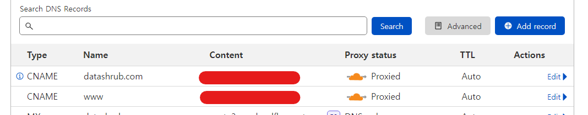
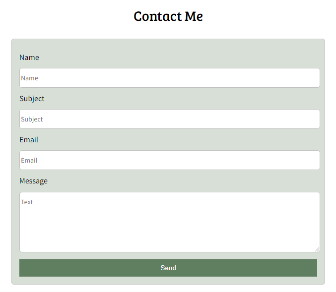

# Datashrub

## Overview
The Datshrub website is an active professional portfolio designed to track and host personal background, skills, and projects.

This specific project incorporates HTML, CSS, and JavaScript to build a portfolio website hosted and routed to a custom domain in Cloudflare.

# Requirements + Features
Original Features are indicated with a *

- Navigation Bar
    - Drop Down Menu*
- Theme Changing
- Portfolio Display
- Form Processing*
- DNS Management*
- Image Zoom*

# DNS Management and Hosting
The Datashrub website is hosted through Cloudflare Pages and linked to the datashrub.com domain.

The domain and www. subdomain are linked to the website using a CNAME record after verifying domain and application ownership through MX and TXT records not shown above.

# Form Processing

The contact form is processed using a FormSubmit endpoint through an encrypted link to prevent email exposure.

The form additionally uses a honeypot filter and Google reCAPTCHA to prevent spam generated by web scrapers.

# References
This guide follows Traversy Media's Website Deployement Guide as an initial template: https://www.youtube.com/watch?v=r_hYR53r61M

Original features that are NOT drawn from this guide are marked with a * as indicated above.

